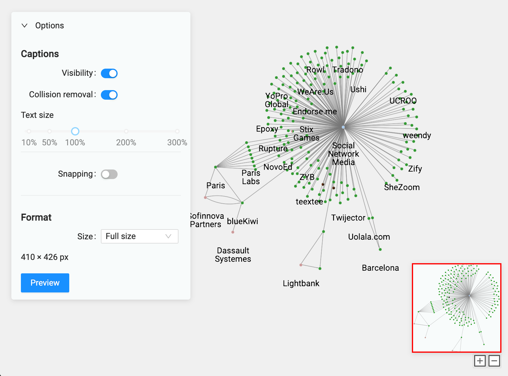
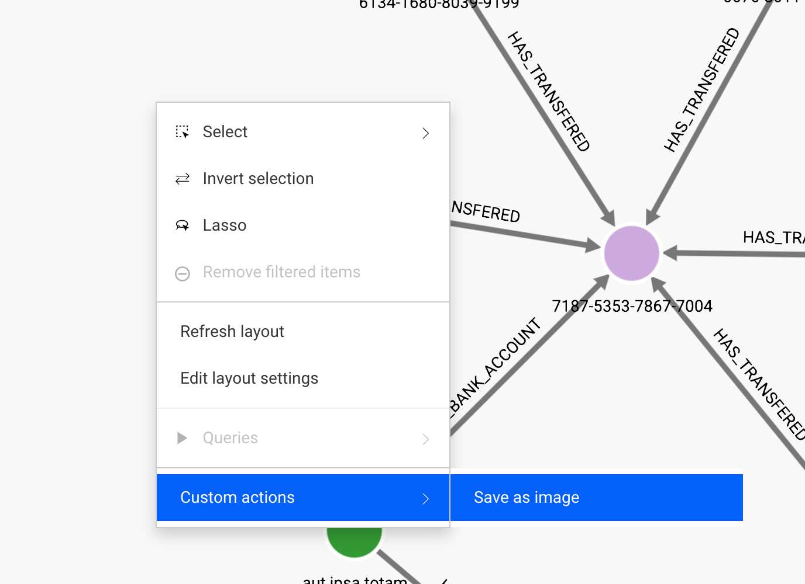
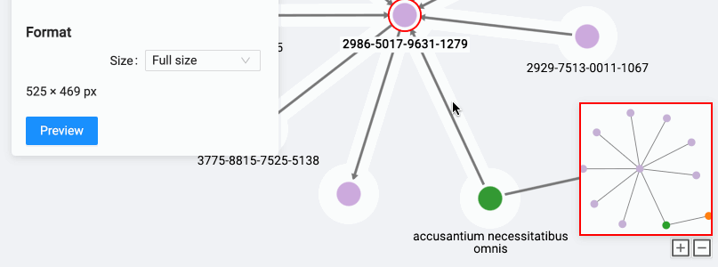
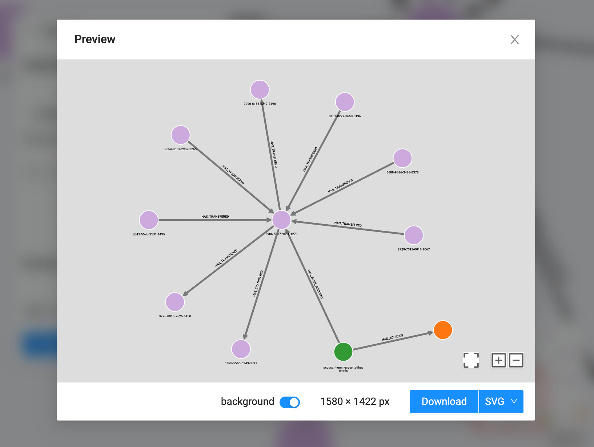
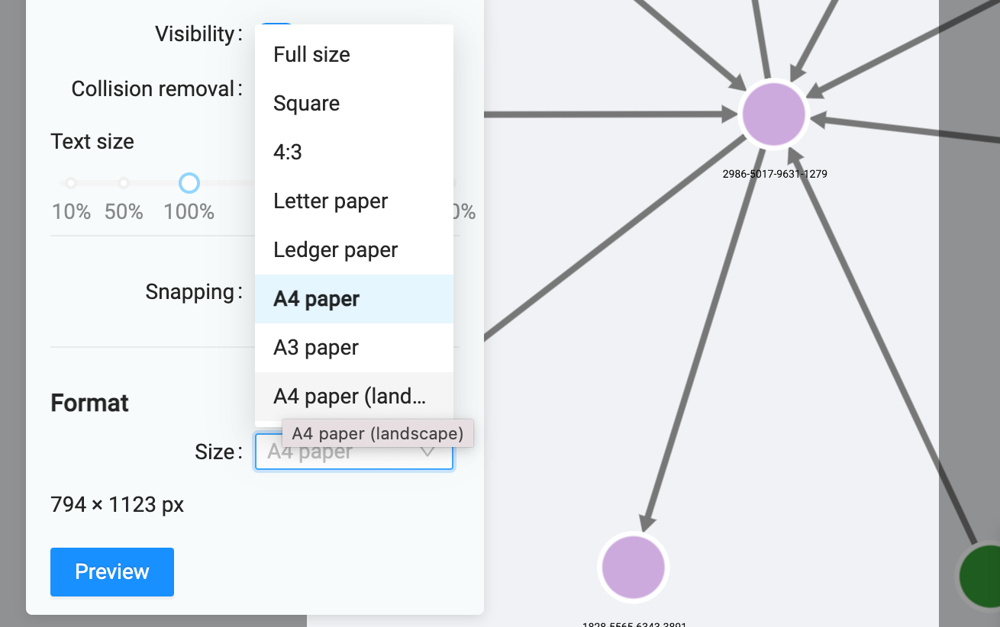
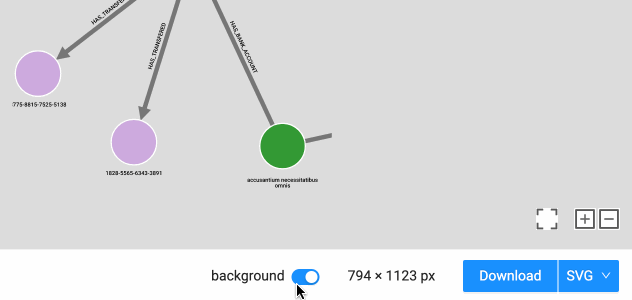
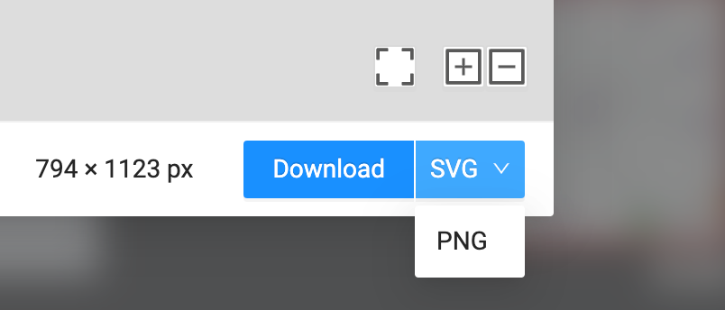

# Image export plugin for Linkurious Enterprise

This plugin allows you to export the visualization with better quality and more settings.

## Configuration

Plugin is available through a custom action:

1.  In visualization menu, select "Manage custom actions..."
2.  "New custom action"
3.  Custom action name: "Save as image"
4.  URL template is `{{baseURL}}plugins/custom-image-export/?id={{visualization}}&sourceKey={{sourceKey}}`. This will allow the custom action to access the visualization.
5.  You can also share the custom action thus making it avalailable for other users of Linkurious Enterprise in your company.
6.  "Save"

Now, once the visualization is saved, you will have a custom action in your context menu that will allow you to export the visualization as an image. To call it, right-click anywhere on your visualization, "Custom actions" &rarr; "Save as image".

This will open the plugin in another tab in your browser. In the plugin, you can select the format and the size of the image. Available formats are <abbr title="Scalable Vector Graphics">SVG</abbr> and <abbr title="Portable Network Graphics">PNG</abbr>.

## Export settings

- **Text:**
  - **visibility** - you can show/hide all the node and edge captions
  - **scaling** - you can scale all the captions to be 1-300% of the original size
  - **overlap** - you can chose to disable the automatic overlap removal policy for the captions and arrange them manually in such a way that they are readable
- **Background:** You can chose to export the background of the visualization or to export it with a transparent background in order to put it on your own custom background.
- **Export size:**
  - **Full-size:** You can chose to export the whole graph at the detalization level that you are currently seeing on the screen.
  - **Pre-defined sizes** - you can also go for the pre-defined document sizes (for instance, for printing) and _fit_ your visualisation into it, using panning and zooming. If you are aming at embedding your exported images into presentations, please refer to the [pre-defined PowerPoint slide sizes](https://support.microsoft.com/en-us/office/change-the-size-of-your-slides-040a811c-be43-40b9-8d04-0de5ed79987e) - for the modern system that would be `Widescreen`. For printing, you have a selection of popular document sizes, from A3 to letterhead. It is preferrable to use SVG file format for printing, as it is vectorial and will produce higher quality prints. Note that if you select the pre-defined document size, the parts of the graph that are not fitting into it, will be clipped.

## Full-size export

It's the default mode of the plugin. In this mode, the visualization will be exported at the current zoom level and detalization level, so nodes, edges and texts will have exactly the same size as you can see on your screen.

The indicator in the settings panel will show the calculated size of the exported image. From here you can continue to the preview, where you will be able to check the details of the resulting image.

## Pre-defined formats

You can also go for pre-defined export document sizes from the list:

After you chose the document size, the plugin will calculate the size of the exported image and show it in the settings panel. It will also show the format boundaries on the screen so that you could fit the whole graph or a part of it into the document size.

## Background Export

You can chose whether or not to include the background color defined in Linkurious Enterprise settings into the exported file. The selector for that is located on the bottom of the preview window.

## Chosing format

Currently the plugin offers two formats: SVG and PNG. You can choose the format by clicking on the arrow next to the format name in the preview window.

- <abbr title="Scalable Vector Graphics">SVG</abbr> - this is the vector format that would offer the best quality and file size for printing and sharing on the web. It has all the fonts and images embedded into the document. It is also editable by the popular vector graphics applications such as [Adobe Illustrator](https://www.adobe.com/), [Inkscape](https://inkscape.org/) and lots of others. They can also be resized and embedded into the presentations and documents without any quality loss.
- <abbr title="Portable Network Graphics">PNG</abbr> - this is the raster format and its adavantage is that it can be viewed by more applications, such as default image viewers on any operating system. Resizing the PNG documents will cause blurriness and degraded quality.
